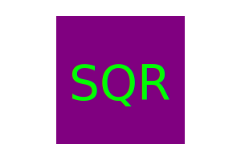

# SVG Logo Generator
  
 
  ## Description
  
  A command-line interface for desiging simple logos in an SVG image format. 

    
    
    
  
  ## Table of Contents
  
  - [Installation](#installation)
  - [Usage](#usage)
  - [Contributing](#contributing)
  - [Tests](#tests)
  - [Questions](#questions)
  - [License](#license)
  
  ## Installation
  
  After cloning the repository, you will need to use npm i to install the modules. 
  
  ## Usage
  
  To use the software, you simply need to run it as node index.js from your command line. Please see the video below for additional usage information. 
  
  ## Contributing
  
  This project is personal - please create a fork if you would like to continue development. 
  
  ## Tests
  
  This project uses Jest as a test suite. after installing the program, you can run npm test from the command line.
  
  ## Questions
  
  Please reach out to me at <m.j.knudson@gmail.com> with any questions you have about this application. My GitHub profile is located at: <https://github.com/Shagomir>
  
  ## License

  
  
  Copyright 2023 Matt Knudson

  

